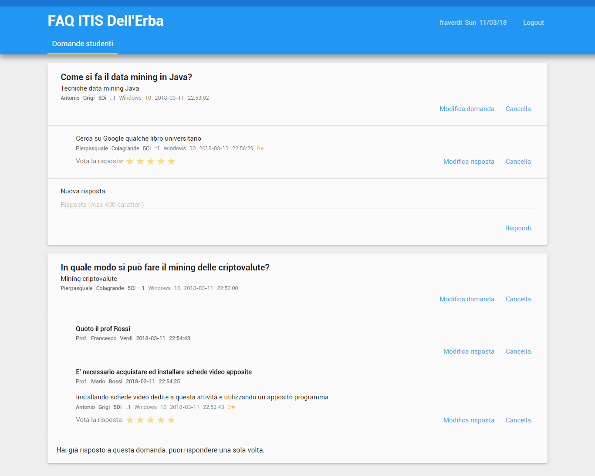
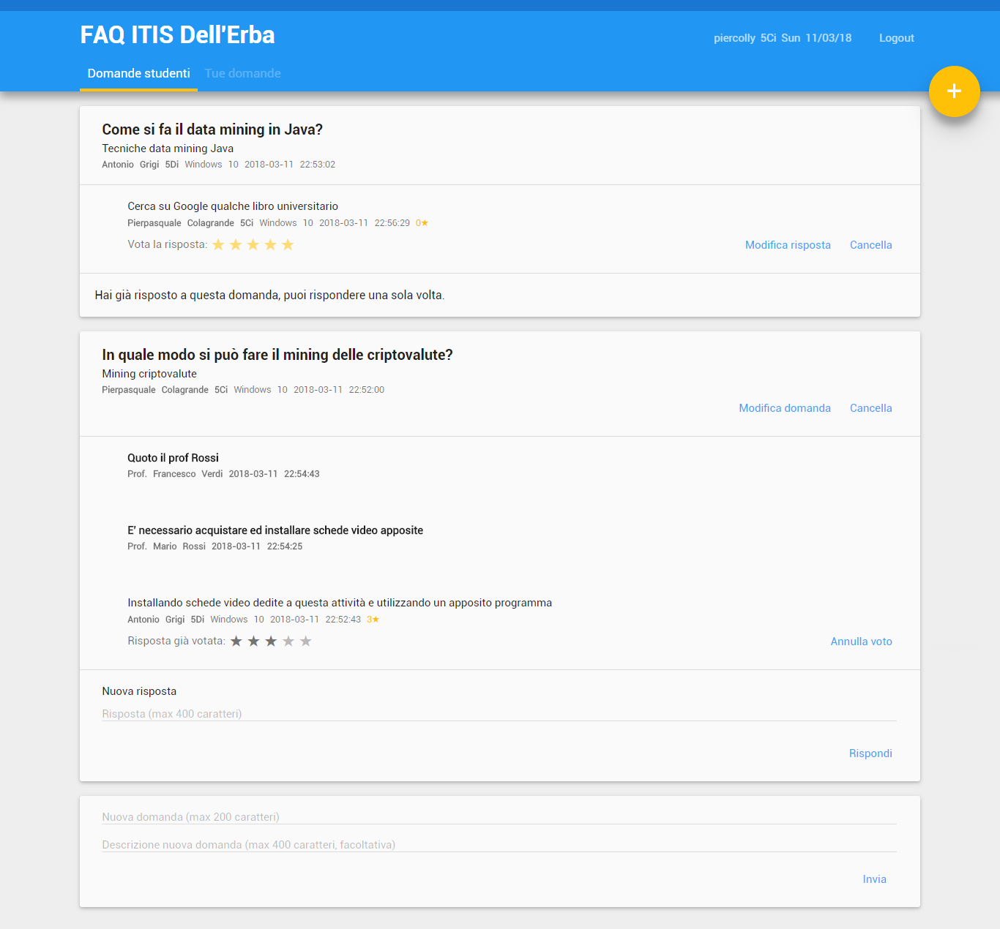
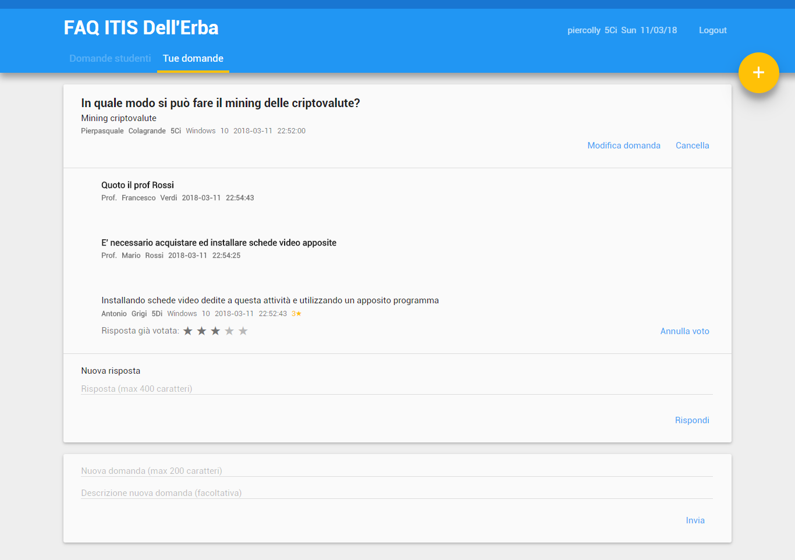
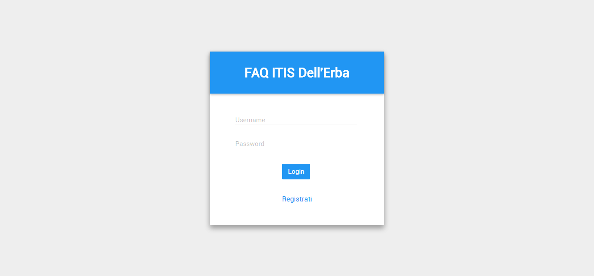
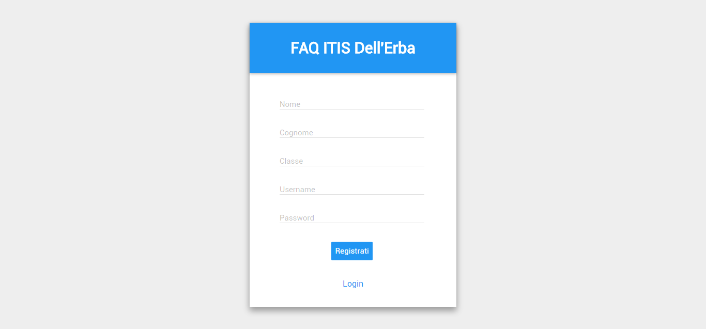

# FAQ Teachers-Students

This project helps school teachers to interact with their students. Students can make questions or answer other user's questions. They can also vote answers. Teachers can answer questions and vote other users' questions.

I made this project during the last year at high school on a specific request of my IT teacher that needed a system to help his students with their doubts.

### Main Functionalities

These are the main functionalities provided by the system.

**Student side:**
1. Making questions
   - Students can delete or modify their own questions
2. Answering questions
   - Students can delete or modify their own answers
3. Voting answers
   - Students can delete their own votes

**Teacher side:**
1. Answering students' questions
   - Teachers can delete or modify their own answers and students' answers
2. Deleting or modifying students' questions
3. Voting students' answers
   - Teachers can delete their own votes
   
Students can also register to the system, but for teachers you need to add this manually to the database. We did this because this system was made for schools who wants to implement a private FAQ system. See **Installing** section for details on how to add teachers.

## Getting Started

To install this system on your machine for testing and development purposes you need a webserver and also an IDE or editor for web development. See **Deployment** for notes on how to deploy the project on a live system.

### Prerequisites

You will need a local php development platform that contains also MySQL to manage SQL databases. I've used XAMPP and I highly recommend it. XAMPP uses Apache HTTP Server to run locally php websites, but it also contains MySQL service to manage SQL databases and other tools like Apache Tomcat, FileZilla and Mercury. Also, it is completely free.
**Notice that the webserver must support php 5.6 version.** Here are some local php development platforms:

* [XAMPP](https://www.apachefriends.org/it/download.html)
* [WAMP](http://www.wampserver.com/en/#download-wrapper)
* [EasyPHP](http://www.easyphp.org/easyphp-devserver.php)

You will also need an IDE or an editor supporting PHP, CSS, HTML, Javascript and SQL languages. I've used PhpStorm, which is a very good web IDE, but this is not free. You can also use simple code editors, you don't necessarily need an IDE.
Here are some IDEs and editors.

**IDEs**
* [PhpStorm](https://www.jetbrains.com/phpstorm/) (This is not free, I'm providing the trial version)
* [Netbeans](https://netbeans.org/features/php/index.html)

**Editors**
* [Notepad++](https://notepad-plus-plus.org/)
* [Sublime Text](https://www.sublimetext.com/)
* [Emacs](https://www.gnu.org/software/emacs/)

### Installing

Once you installed the programs mentioned above, follow these steps to install the system locally.

1. Download the entire repository and extract the [FAQ](FAQ) folder in the webserver root folder (for example, in XAMPP this folder is called `htdocs`; see the documentation of your webserver to know the name of the root folder)
2. Once you extracted the [FAQ](FAQ) folder, run the webserver and also the MySQL service
3. Open the [database.sql](FAQ/database.sql) file in the [FAQ](FAQ) folder with an editor and copy the entire content of the file
4. Open your browser and go to `localhost/phpmyadmin`
5. Open the SQL tab and paste the content of [database.sql](FAQ/database.sql) file into the text field and click on Go/Run/Execute command
6. Now the system is fully installed, you can go to `localhost/FAQ` in you browser to use the website

You can also modify the files for development purposes and then go to `localhost/FAQ` in your browser to test the modified system. You don't need to shut down your webserver and turn that on again to enable modifications, you can work on the website with the webserver on.
Two teachers are automatically added to the system for testing purposes, you can remove them with phpmyadmin or without executing the two last queries in the [database.sql](FAQ/database.sql) file. You can add new teachers directly by querying the database or with phpmyadmin interface. Here's a query template to add teachers.

```
insert into Utenti values (null,true,"FIRST_NAME","LAST_NAME","USERNAME","ENCRYPTED_PASSWORD",null);
```

To encrypt passwords, we use php password_hash function. To create your encrypted password with this function, use [this website](http://www.passwordtool.hu/php5-password-hash-generator) . **You have to had the password encrypted with this method or you won't be able to log in as the teacher you added.**

## Deployment

To display this system on a live system, you need a web host that **supports php 5.6 version and that allows you to use MySQL**. Every hosting has his own restrictions and rules so follow the instructions provided by your web host to install this website on a live system.

**Paid web hosting**
* [GoDaddy](https://www.godaddy.com/)
* [BlueHost](https://www.bluehost.com/)
* [Amazon AWS Hosting](https://aws.amazon.com/websites/)

**Free web hosting**
* [Wix](https://www.wix.com)
* [Altervista](https://www.altervista.org/)

## Built With

* [PhpStorm](https://www.jetbrains.com/phpstorm/) - The IDE used
* [XAMPP](https://www.apachefriends.org/) - The webserver used
* [Notepad++](https://notepad-plus-plus.org/) - The editor used for minor modifications

## Contributing

To contribute to this project, see [CONTRIBUTING.md](CONTRIBUTING.md).

## Authors

* **Pierpasquale Colagrande** - _Initial work_ - [pierclgr](https://github.com/pierclgr)

See also the list of [contributors](https://github.com/pierclgr/FAQ-TEACHERS-STUDENTS/contributors) who participated in this project.

## License

This program is licensed under GNU General Public License v3, see [LICENSE](LICENSE) for more details.

## Acknowledgments

* School lessons in php and sql development
* Always friendly neighborhood Google
* [W3C School](https://www.w3schools.com/) for languages tutorials

## Screenshots






